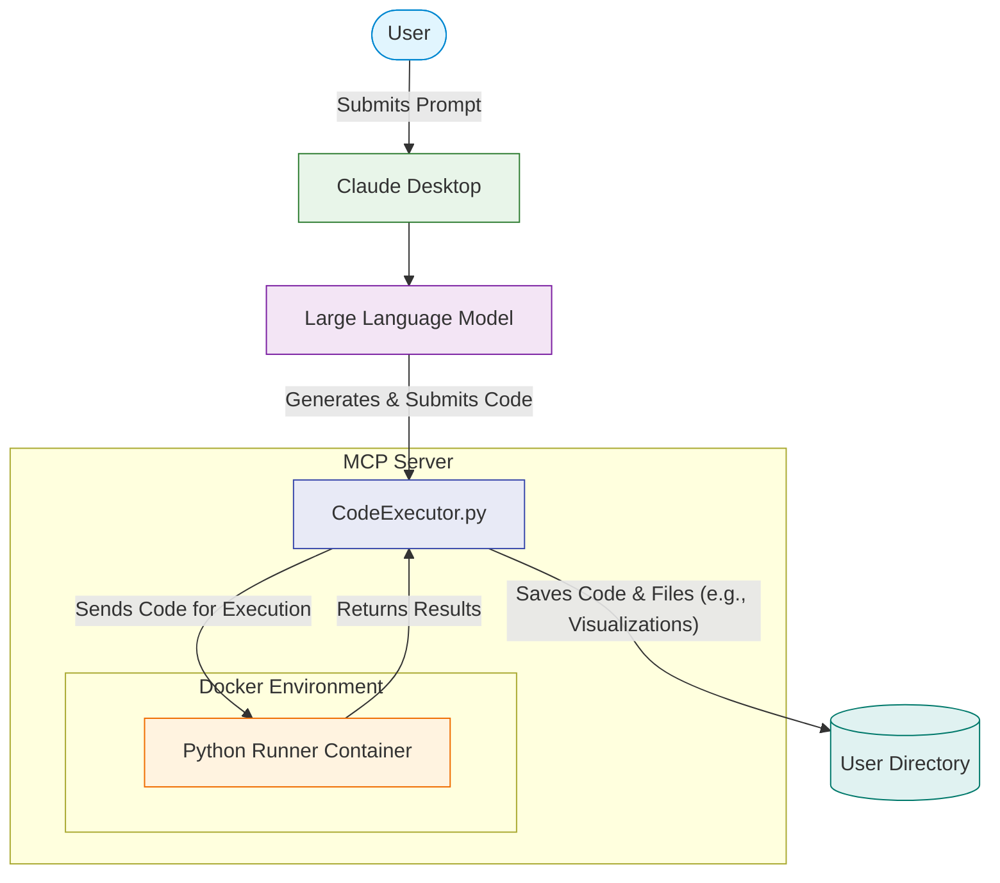

# Tarte Tatin

A secure Python code execution service that runs code in isolated Docker containers.

To use Coinmetrics specific code, you should provide the contents of the instructions.md file in the context for the LLM.
If it's possible to store this in a system prompt, do that.

## Features

- Execute Python code securely in isolated Docker containers
- Automatic dependency detection and installation
- Coinmetrics API integration for cryptocurrency data analysis
- File output management with size and quantity limits



## Setup

### Prerequisites

- Docker
- Python 3.10+
- uv (Python package installer)

### Installation

0. Install uv (Python package manager)

   ```
   brew install uv
   ```

1. Clone the repository:
   ```
   git clone <repository-url>
   cd tarte_tatin
   ```

2. Set required environment variables:
   ```
   export CM_API_KEY=your_coinmetrics_api_key
   ```

3. Build the Docker image:
   ```
   docker build -t python-runner .
   ```

4. Run install script:
   ```
   uv run install.py
   ```

5. Copy and paste the contents of `instructions.md` into your Claude Desktop preference


## Usage

Ask Claude a question such as "Create a candle graph of ETH-USD on kraken for 30 days"

Find any output in your home drive, in a folder called `output-files`

## Containers

The Docker container includes:
- Python 3.9
- Essential data science libraries (pandas, matplotlib, numpy)
- Coinmetrics API client
- Automatic dependency installation using uv

## Security

Code executes in an isolated container with:
- No access to local files (only an empty TMP directory)
- Controlled output file management: only max 5 files get copied to the users' `output-files` 
- Network access outbound for calling the API


