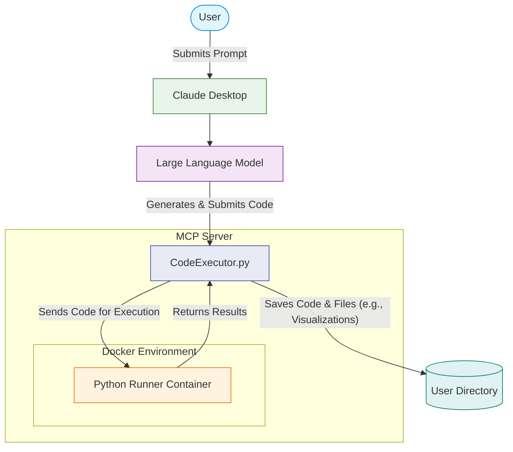

```mermaid
flowchart TD
    User([User])
    ClaudeDesktop[Claude Desktop]
    LLM[Large Language Model]
    CodeExecutor[CodeExecutor.py]
    PythonRunner[Python Runner Container]
    UserDir[(User Directory)]
    
    User -->|"Submits Prompt"| ClaudeDesktop
    ClaudeDesktop --> LLM
    LLM -->|"Generates & Submits Code"| CodeExecutor
    CodeExecutor -->|"Sends Code for Execution"| PythonRunner
    PythonRunner -->|"Returns Results"| CodeExecutor
    CodeExecutor -->|"Saves Code & Files (e.g., Visualizations)"| UserDir
    
    subgraph MCP[MCP Server]
        CodeExecutor
        subgraph Docker[Docker Environment]
            PythonRunner
        end
    end
    
    classDef user fill:#e1f5fe,stroke:#0288d1,stroke-width:1px
    classDef desktop fill:#e8f5e9,stroke:#2e7d32,stroke-width:1px
    classDef llm fill:#f3e5f5,stroke:#7b1fa2,stroke-width:1px
    classDef mcp fill:#e8eaf6,stroke:#3949ab,stroke-width:1px
    classDef docker fill:#fff3e0,stroke:#ef6c00,stroke-width:1px
    classDef storage fill:#e0f2f1,stroke:#00796b,stroke-width:1px
    
    class User user
    class ClaudeDesktop desktop
    class LLM llm
    class CodeExecutor mcp
    class PythonRunner docker
    class UserDir storage
```